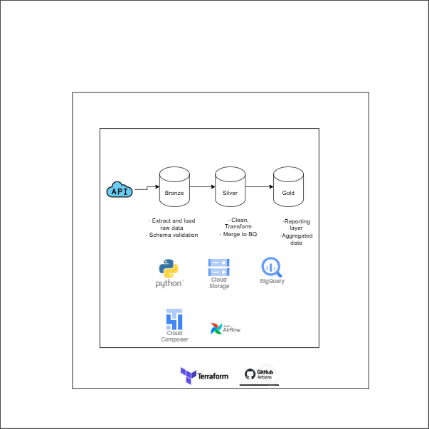

#  Citi Bike ETL Workflow for Analytics-Ready Data

This project builds an ETL pipeline that consumes Citi Bike’s open API data and stores it in a well-structured gold-level table. The cleaned and unified data is designed to support future analytics and decision-making processes, such as:

- Identifying stations that are frequently full or empty.
- Improving resource allocation for bike availability.
- Analyzing station-level usage patterns.


---

## Architecture



The pipeline takes a weekly snapshot and provides the updated data. It follows **Bronze → Silver → Gold** data architecture pattern:

### Bronze Layer
- Extracts and loads raw Citi Bike data from the API.
- Stores raw JSON files in Google Cloud Storage (GCS).
- Performs JSON schema validation.

### Silver Layer
- Cleans and flattens raw JSON data using Pandas, handling timestamp formats, missing values, and data type conversions.
- Writes cleaned data to a GCS Silver bucket and loads it into a BigQuery staging table with additional derived columns like is_station_empty and is_station_full.
- Uses a MERGE operation to update the master BigQuery table with only new or changed records from the staging table.

### Gold Layer
- Aggregates and curates data for reporting and dashboarding.

---

## Technologies Used

| Tool             | Purpose                                |
|------------------|----------------------------------------|
| Python           | Data extraction, validation, transformation |
| Google Cloud Storage | Stores raw and intermediate data       |
| BigQuery         | Data warehousing and analytics          |
| Airflow/Composer | Orchestrates the data pipeline          |
| Terraform        | Infrastructure as Code (IaC)            |
| GitHub Actions   | CI/CD for deployment workflows          |

---

## Folder Structure

```bash
.
├── dags/                     # Airflow DAGs
├── plugins                   # Python scripts for ETL
├── sql/                      # Schema definition files for BigQuery tables
├── terraform/                # Infrastructure configuration
├── data/                     # SQL for Silver (staging) and Gold (aggregation) layers
├── README.md                 # Project documentation

```

## Setup Instructions
1. Clone the repository
2. Add your GCP Service Account JSON key as a secret in your GitHub repository ( GCP_SA_KEY)
3. Install dependencies using Poetry
    ```
    poetry install
    ```
4. Modify variable values in the terraform files to match your GCP project, region, and desired bucket names
5. Update environment secrets in github
6. Pass bucket names and other runtime parameters to the DAGs
7. Push the code to github and it will trigger a CI/CD workflow on master branch

